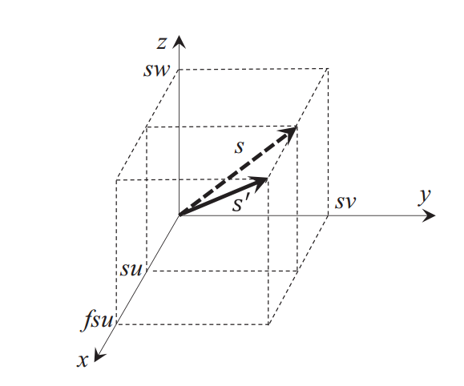

# Monte Carlo perturbation methods using "virtual density" theory for calculating reactivity due to geometry change(用虚拟密度法计算几何变化反应性的蒙卡微扰法)

* 出版年份：2018
* 作者：Toshihiro Yamamoto, Hiroki Sakamoto
* 机构：东京大学 Institute for integrated radiation and nuclear science
* 出版期刊：Annals of Nuclear Energy
* 阅读时间：2019/10/01~2019/10/10
* 文献类型：数值方法+验证
* DOI:10.1016/j.anucene.2018.05.006
* 评价：一般

 [The title of this paper(文章标题)](#the-title-of-this-paper%e6%96%87%e7%ab%a0%e6%a0%87%e9%a2%98)
  - [Summary(总结)](#summary%e6%80%bb%e7%bb%93)
  - [Key Citations(关键点)](#key-citations%e5%85%b3%e9%94%ae%e7%82%b9)
  - [Comments(评价)](#comments%e8%af%84%e4%bb%b7)
  - [Outlines(大纲)](#outlines%e5%a4%a7%e7%ba%b2)
    - [1. Research Objective(研究目标)](#1-research-objective%e7%a0%94%e7%a9%b6%e7%9b%ae%e6%a0%87)
    - [2. Background and Problems(研究背景和问题)](#2-background-and-problems%e7%a0%94%e7%a9%b6%e8%83%8c%e6%99%af%e5%92%8c%e9%97%ae%e9%a2%98)
    - [3. Methods(研究方法)](#3-methods%e7%a0%94%e7%a9%b6%e6%96%b9%e6%b3%95)
    - [4. Conclusion(总结)](#4-conclusion%e6%80%bb%e7%bb%93)
  - [Notes(其它笔记)](#notes%e5%85%b6%e5%ae%83%e7%ac%94%e8%ae%b0)

---

## Summary(总结)
本文主要将两种本用于截面改变反应性计算的蒙卡微扰方法微分算子抽样法(differential operator sampling, DOS)和相干抽样法(correlated sampling, CS)用于几何改变反应性计算，引入虚拟密度法，研究了各向同性均匀膨胀(expansion)和肿胀(swelling)，和各向异性均匀膨胀和肿胀(只在一个方向膨胀或肿胀），重点在后者。其中对于各向异性均匀膨胀，通过将拉伸或者压缩此方向的中子平均自由程视为随机游走过程进行处理，基于输运理论而不是扩散理论，建立了新的蒙卡算法，这是本文的主要新意。最后DOS和CS法的计算结果都与利用离散纵标法输运程序DANTSYS计算的结果进行对比，符合很好。

---

## Key Citations(关键点)

1. 在虚拟密度法中，expansion 和 swelling 是不同的。
   * expansion 是保持密度不变，体积变化，从而质量会变化，是一种"扩张"，不是我们通常所说的膨胀（想不通这种expansion有什么现实对应）。在虚拟密度法中，若几何扩张个f因子，是通过材料密度增加f因子来代表的（因为expansion是质量变大，从而在几何不变的情况下相当于是密度变大）
   * swelling 是保持质量不变，体积变化，从而密度会变化，比如通常意义上的热膨胀。在虚拟密度法中，若几何各向同性swelling个f因子，则是通过材料密度减少$f^{n-1}$因子实现的
2. 均匀各向同性变化和均匀各向异性的区别：
   * 均匀是指表面每个点都是朝该方向移动相同距离
   * 各向同性是指每个方向都相同比例变化，整个几何是相似变化
   * 各向异性是指不同方向变化比例不同，变化前后几何不相似
3. 在虚拟密度法中，若是均匀各向异性膨胀(expansion)，如方形在x方向expansion，则必须通过压缩x方向上中子平均自由程来估计；但若是均匀各向异性肿胀(swelling)，如方形在x方向swelling，则必须通过拉伸其他方向（y方向）的中子平均自由程来估计。中子自由程变化即宏观输运截面变化。
4. CS相干抽样法（correlated sampling method）
   * 关键点是通过在每次碰撞处计算反应性变化，再把所有的碰撞产生的影响加起来。
   * 根据总截面$\Sigma_t$抽取中子飞行距离$s=-\dfrac{\ln{\xi}}{\Sigma_t}$，假设中子碰撞前的权重是$W$，计算碰撞后的权重$W'$。若是在微扰前，则变为$W\dfrac{\Sigma_s}{\Sigma_t}$，若是在微扰后，则变为$We^{-\Delta\Sigma_ts}\dfrac{\Sigma_s'}{\Sigma_t}$。这里认为微扰中不考虑微观截面的变化，那么宏观截面$\Sigma$和核密度$N$成正比。若核密度改变f因子，则微扰后的中子权重可表示为$W'=We^{-(f-1)\Sigma_ts}\dfrac{f\Sigma_s}{\Sigma_t}$。第m中子历史(mth history)后反应性变化为
    $$
    \Delta k_{eff,m}=\sum_i\dfrac{\nu \Sigma_f}{\Sigma_t}(fW_i'-W_i)
    $$
    然后再对这一代中的所有中子历史进行平均得到该代的反应性变化
    $$
    \Delta k_{eff,n}=\dfrac{1}{M}\sum\limits_{m=1}^{M}\Delta k_{eff,m}
    $$
    最后对所有活跃代的$\Delta k_{eff,n}$求平均得到微扰导致的$k_{eff}$变化。
   * 这里没有考虑微扰导致的源分布变化，作者认为不重要，不过也有文献考虑这个，本文作者也再某写算例做了相应计算。
   * CS法当微扰较大时会方差很大
5. DOS微分算子抽样法（differential-operator sampling method）
   * DOS法是在每一次粒子飞行或者碰撞时计算反应性微分系数，然后利用泰勒展开近似得到反应性值的变化。
   * 中子输运时的输运核为$T\left(\mathbf{r} \rightarrow \mathbf{r}^{\prime} ; f\right)=\Sigma_{t}(f) e^{-\Sigma_{t}(f) s}$，当材料密度变化$f$因子，则输运核一阶权重系数为$$\left. \frac{\partial}{\partial f} \ln{T}\left(\mathbf{r} \rightarrow \mathbf{r}^{\prime} ; f\right)\right|_{f=1}=1-s\Sigma_t$$则mth particle history的$k_{eff}$反应性随$f$变化的导数是$$\frac{\partial}{\partial f} k_{e f f, m}=\sum_{i} \frac{v \Sigma_{f, i}}{\sum_{t, i}} w_{i} S_{i, 1}$$其中$w_i$是第$i$次碰撞的粒子权重，$S_{i,1}=\sum\limits_k (1-s_k\Sigma_t)$是到第i次碰撞时的输运核总和。
   * DOS可以进行任意阶计算，本文主要用二阶DOS，对应的$\left. \frac{\partial^2}{\partial f^2} \ln{T}\left(\mathbf{r} \rightarrow \mathbf{r}^{\prime} ; f\right)\right|_{f=1}=-1$，$\frac{\partial^2}{\partial f^2} k_{e f f, m}=\sum_{i} \frac{v \Sigma_{f, i}}{\sum_{t, i}} w_{i} (S_{i, 1}^2+S_{i,2})$，其中$S_{i,2}=\sum\limits_{j=1}^i-1=-i$。如此在进行平均得到关于$k_{eff}$的一阶导和二阶导，从而由泰勒展开有
    $$
    \Delta k_{e f f, n} \approx k_{e f f, n}^{(1)} \Delta f+\frac{1}{2} k_{e f f, n}^{(2)} \Delta f^{2}
    $$
    * DOS可以通过高阶做得很精确，不过对于高阶DOS需要考虑微扰对裂变源的影响
6. 均匀各项同性expansion 和swelling算例是一个3$\times$3的轻水堆燃料组件，利用标准的热工分析软件SRAC产生群常数。蒙卡的计算结果与基于离散纵标法的DANTSYS程序确定论差分计算结果相对比。并且也用蒙卡进行了差分计算进行对比。结果三者符合很好。这里看一组反应性变化的数据，在swelling时，当$\Delta f=0.01$时，$k_{eff}$减少221pcm；当$\Delta f=0.1$时，$k_{eff}$减少2311pcm。
7. 作者定义了一个计算的品质因子$\dfrac{1}{\sigma^2T}$用于评价计算效率，其中$\sigma$是标准差,T是计算时间。发现当微扰较小时，用CS或者DOS微扰计算都比差分计算效率高，但是当微扰较大时，则不如直接差分计算。而CS和DOS相比，CS的方差更大，受微扰程度变化影响较大，没有那么稳定。而DOS在处理expansing和swelling相比，更适合处理expansion，作者认为因为swelling时几何和材料密度都有改变，因此DOS的高阶微分项影响更大，因此没有那么准。
8. 对于均匀各向异性膨胀肿胀，本文只考虑方形单方向的均匀形变，虚拟密度法通过改变中子平均自由程来进行。
   * 若没有微扰，则中子在(x,y,z)发射飞行到下一点时有$x'=x+su,y'=y+sv,z'=z+sw$，而若x方向中子自由程被压缩或拉伸，则有$x'=x+fsu$，而其他方向不变，因此使得飞行距离，飞行方向等都发生了相应改变
当粒子穿越材料交界时，不同于传统蒙卡直接重新抽样，虚拟密度理论的蒙卡依然需要进行压缩拉伸，即新材料中的飞行距离为$$-\frac{\ell n \xi^{\prime}}{\Sigma_{t}^{\prime}} \frac{s^{\prime}}{s}=-\frac{\ell n \xi^{\prime}}{\Sigma_{t}^{\prime}} \sqrt{1+u^{2}\left(f^{2}-1\right)}$$
   * 当x方向expansion个f因子时，则对x方向的中子自由程乘上1/f因子；当x方向swelling个f因子时，则对其他方向(y,z)种子自由程乘上f因子。
    * 对于各向异性时的DOS公式推导，区别在于截面变化不再是单纯的f关系，而是$$\Sigma_{t} \Rightarrow \Sigma_{t}(f)=\frac{\Sigma_{t}}{\sqrt{(f u)^{2}+v^{2}+w^{2}}}$$再计算输运核一阶导权重因子$\frac{\partial}{\partial f} \ln{T}\left(\boldsymbol{r} \rightarrow \boldsymbol{r}^{\prime} ; \boldsymbol{f}\right)$，从而计算$k_{eff}$的一阶导$\frac{\partial}{\partial f} k_{e f f, m}$，相应公式都同前。同理求输运核的二阶导和$k_{eff}$的二阶导。最后通过泰勒展开近似求得$k_{eff}$的变化，
    * 对于CS方法，在之前的公式中，只是$\Sigma_{s}^{\prime}=\frac{\Sigma_{s}}{\sqrt{(f u)^{2}+v^{2}+w^{2}}}$
  
---

## Comments(评价)

1. 不太理解这里保持密度增加质量的expansion到底有什么实际对应，更多的是保持质量改变密度的swelling吧？蜜汁
2. 为什么各向同性均匀expansion是将密度增大f因子，而swelling是将密度减小$f^{n-1}$因子，怎么算得的？
3. 对传统的相干CS法和DOS法也不太懂，何以称为“相干”？还得补补一些基本的中子蒙卡知识zz
4. 虚拟密度的基本物理原理是什么，为什么能这样用密度替代几何变化？需要看Reed的文章了解基本原理
5. 确定论的虚拟密度微扰和蒙卡的虚拟密度微扰哪个更有优势？感觉蒙卡的更不错，相对误差在0.2%~1.4% 左右，而西交的文章确定论计算相对误差在1.4%~6% 都有

---

## Outlines(大纲)

### 1. Research Objective(研究目标)

- 运用虚拟密度法进行蒙卡几何微扰反应性计算，尤其是对于均匀各向异性时的中子自由程伸缩算法，是本文的重点

### 2. Background and Problems(研究背景和问题)

- 微扰研究在之前主要集中在核密度变化引起的，而几何微扰研究主要在确定论方法上，因为需要估计伴随通量。而蒙卡在几何微扰上的研究较少，部分原因是用蒙卡方法估计伴随通量比较困难。近年虚拟密度法提出来用于几何微扰计算，不需要估计伴随通量。而且只需要改变物质密度而不需要精确地改变几何。

### 3. Methods(研究方法)

- 本文主要创新点是通过拉伸和压缩中子平均自由程的方法，结合微扰理论，研究只有一个方向的几何形变的反应性变化。而拉伸和压缩中子平均自由程是通过蒙卡方法中粒子输运随机游走的形式实现的。

### 4. Conclusion(总结)

- 对于均匀各向同性膨胀，虚拟密度法能够很好地计算反应性变化。传统蒙卡算法CS和DOS能够直接用于均匀各向同性蒙卡微扰计算。在小微扰情况下微扰方法在精度和计算效率方面表现更好。
- 对于均匀各向异性膨胀，通过拉伸或压缩单方向的中子平均自由程实现，提出了新的算法。对于大的微扰，DOS可以通过提高阶数来提高精度
- 待考虑的问题：
  - 非均匀几何形变还不会
  - 内部几何形变影响不会
  - 复杂几何、复杂组分、连续能量的真实堆芯蒙卡计算不会
  - 微观截面变化没考虑

---

## Notes(其它笔记)

- The ‘‘virtual density” theory in the field of neutronics is a method to quantify reactivity of a reactor core due to geometry changes by altering the material density or nuclear cross section instead of explicitly changing the geometry.
- 
- ...

---
