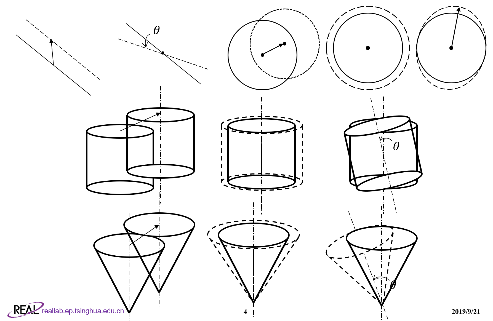

# 基于伴随通量加权的蒙卡几何微扰分析研究

---

* 年份：2018年
* 作者：周梦飞
* 阅读时间：2019年9月9日-21日
* 文献类型：毕设论文
---
[TOC]
---
## 总结

> 本文主要包括三个部分：
> * 李昊师兄提出的基于RMC程序的栅元约束条件微扰法（CCCP方法）的理论背景，包括伴随通量、反复裂变几率IFP、阶跃函数截面变化等，再介绍CCCP方法的主要思路，并以半球栅元为例简单推导了平面平移、旋转、球面均匀膨胀/收缩、栅元整体平移几种微扰的截面导数。
> * 对RMC四种表面共21种类型的不同微扰类型的约束方程微扰导数表达式进行了推导
> * 进行程序实现，改造RMC，使之可以同时进行不同类型表面不同类型扰动的微扰系数的计算，并分别用有限差分和微扰方法计算了6个基准题进行对比

> 本文主要的思路和方法都是现有的，如李昊师兄的CCCP方法，所翻译文献中所提出的反复裂变几率IFP和核密度估计器KDEs、采用阶跃函数表示材料界面变化、主要基准题、用有限差分对比的思路等等。

## 创新点
> * 对RMC其他不同几何不同微扰的导数的数学推导
> * 扩展了RMC功能，修改了输入卡，使之由一次只能处理一个表面一种扰动类型拓展为可以同时处理多表面多类型扰动，并解决了由于表面共用导致的相互影响问题。

## 不足点
> * 对于重复性结构不能单独微扰计算，牵一发而动全身
> * 空间堆控制鼓调整的临界搜索计算
> * 对于大体积系统的几何扰动还有待改进
> * 计算速度比较慢，效率并不一定比有限差分高
> * 对于非均匀扰动依然不能计算
---

## 一些细节
> 1. 伴随通量、伴随算符、伴随方程
> 伴随即为共轭，是一个数学上常用的方法。伴随通量其实是中子价值函数。
> 定义内积 $<\phi^*,\phi>$ 定义算子$L$和$L^*$，当满足
  $$<\phi^*,L\phi>=<L^*\phi^*,\phi>$$ $L^*$为$L$的共轭算子.若有方程$L\phi=0$则方程 $L^*\phi^*=0$ 为其共轭方程，$\phi^*$为$\phi$的共轭函数
> 对于输运方程$$L \Psi+T \Psi=\frac{1}{k} F \Psi+S \Psi$$ 其伴随方程为$$L^{*} \Psi^{*}+T^{*} \Psi^{*}=\frac{1}{k} F^{*} \Psi^{*}+S^{*} \Psi^{*}$$微扰后计算可得微扰系数的伴随加权积分表达式$$\frac{d k}{d x}=\frac{\left\langle\Psi^{*}, \frac{d F}{d x} \Psi\right\rangle- k\left\langle\Psi^{*}, \frac{d T}{d x} \Psi\right\rangle+ k\left\langle\Psi^{*}, \frac{d S}{d x} \Psi\right\rangle}{\left\langle\Psi^{*}, \frac{1}{k} F\Psi\right\rangle}$$现在主要是计算伴随加权积分如$\left\langle\Psi^{*}, \frac{d F}{d x} \Psi\right\rangle$等.

> 2. 反复裂变几率IFP是中子伴随方程的一个解，即满足$$L^{*} I F P+T^{*} I F P-S^{*} I F P=\frac{1}{k} F^{*} I F P$$

> 3. 引入阶跃函数描述材料截面变化,得到统一的数学形式$$\Sigma(r)=\Sigma^{-}+H\left(r-r_{n}\right)\left(\Sigma^{+}-\Sigma^{-}\right)$$从而可以进行求导，会得到狄拉克函数

> 4. 通过径迹长度估计器结合IFP计算伴随加权积分，如
> 
> $${\left\langle\Psi^{*}, \frac{d F}{d x} \Psi\right\rangle=\sum_{i=1}^{N} \sum_{J=1}^{L_{i}} \frac{w_{i, j}}{\mu} \operatorname{IFP}\left(x_{i, j}, y_{i, j}, z_{2}, E_{i, j}, \vec{\Omega}_{i, j}\right)\left(\Sigma_{t}^{-}-\Sigma_{t}^{+}\right)}$$
>

> 5. 栅元约束条件扰动法CCCP法大意：确定栅元约束条件逻辑表达式，再求导取极限得到表面方程对扰动变量的导数

> 6. RMC的四种表面：平面、球面、柱面、锥面
> 考虑的几种微扰：平移（平面、球面、柱面、锥面）、旋转（平面、柱面、锥面）、均匀膨胀/收缩（球面、柱面）、不均匀膨胀/收缩（球面，只单向）、顶角变化（锥面）
> 
> 7. 计算的基准题（4个来自ICSBEP，1个来自基准题衍生、1个自定义）：Godiva球临界、Godiva半球、Topsy双层球、Zeus盘状组件、STACY溶液临界装置、自定义锥形系统。计算结果中STACY算例微扰与有限差分计算结果差距较大，可能因为是大尺度结构。
---

## 疑问
> * 球面单向膨胀或收缩这一几何微扰类型能否用RMC计算实现
> * 不同扰动类型的敏感度不同的原因
> * 大尺寸系统的微扰准确性
> * 在计算旋转的时候为何要给一个初始偏角
> * 栅元中某一个面变形的时候，另一个面不考虑吗，他们之间有约束关系
> * 对于反复裂变几率、伴随通量的物理意义理解还不够
> * 加权的权重如何确定

## 评价

> * 本文创新性没有太多，多是前人基础上的进一步完善
> * 微扰法的使用很好，利用当前结构的结果结合数学工具之间计算微扰带来的影响，而不用改变条件计算前后两次的结果用有限差分近似，计算量会小很多。可以考虑在热管堆的变形中引入微扰因子。

## 大纲

### 研究目标

> 开发基于伴随通量加权的能够同时处理多种几何多种微扰形式的蒙卡程序

### 研究背景和问题

> 有效增殖因子的几何灵敏度分析很重要，可以分析几何不确定度、计算控制棒的微分价值、临界几何搜索等。keff的几何灵敏度分析有有限差分法和几何微扰法。而已有的基于蒙卡的几何微扰法有很多，伴随通量法加权法比较有潜力，已经引入了阶跃函数表示界面变化，核密度估计器的使用，但是现在只能处理简单几何简单微扰。因此本文扩展了几何类型和微扰类型。

## 其他

> 相关英文文章已经发表 doi:10.1080/00295639.2019.1614800，在本文基础上更加详细研究了不同算例中CCCP算法和LLSF的效率的比较。
> 