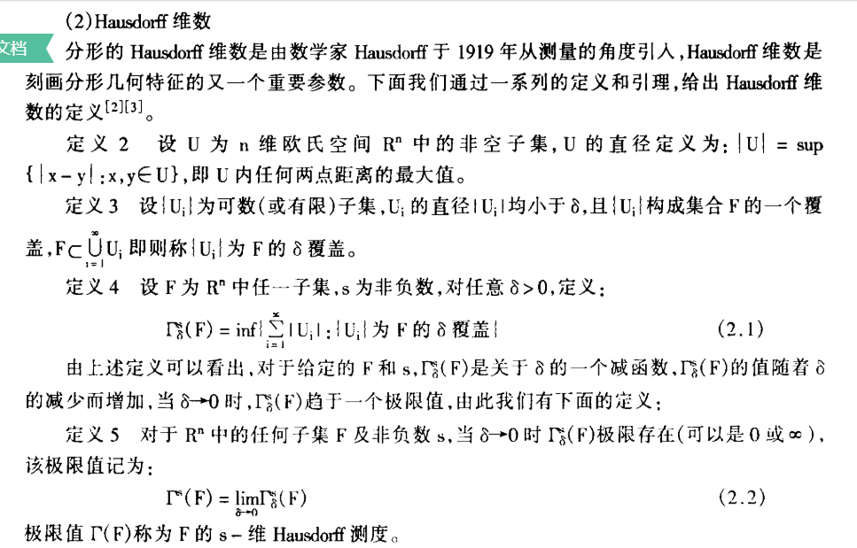
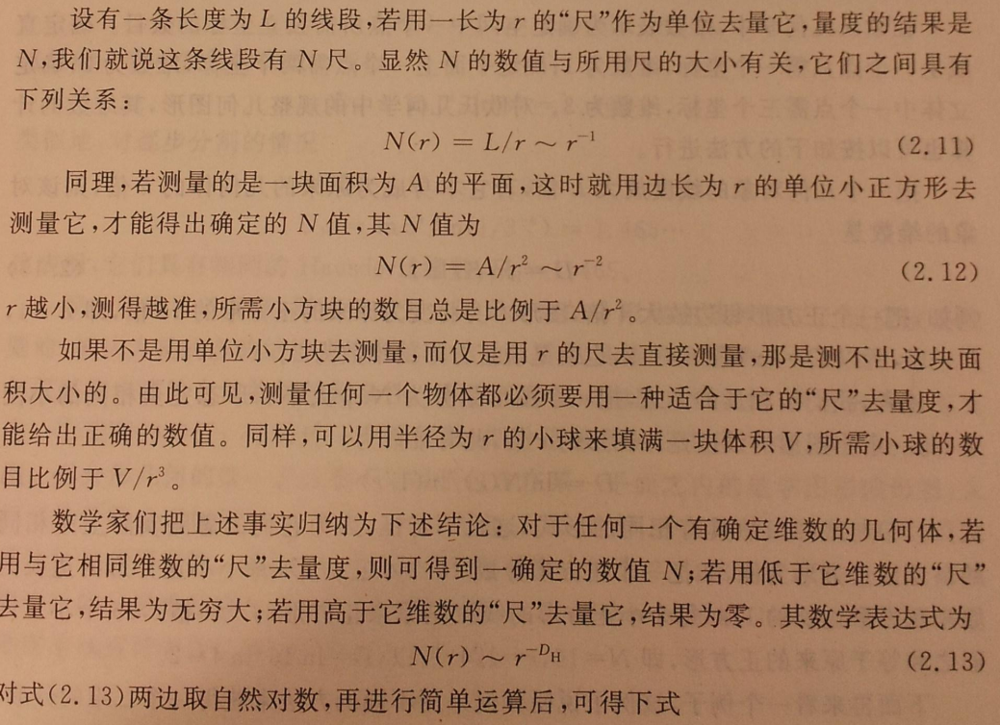
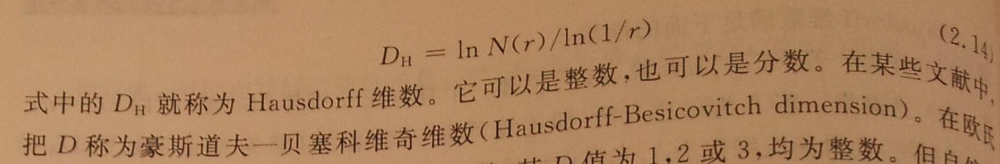
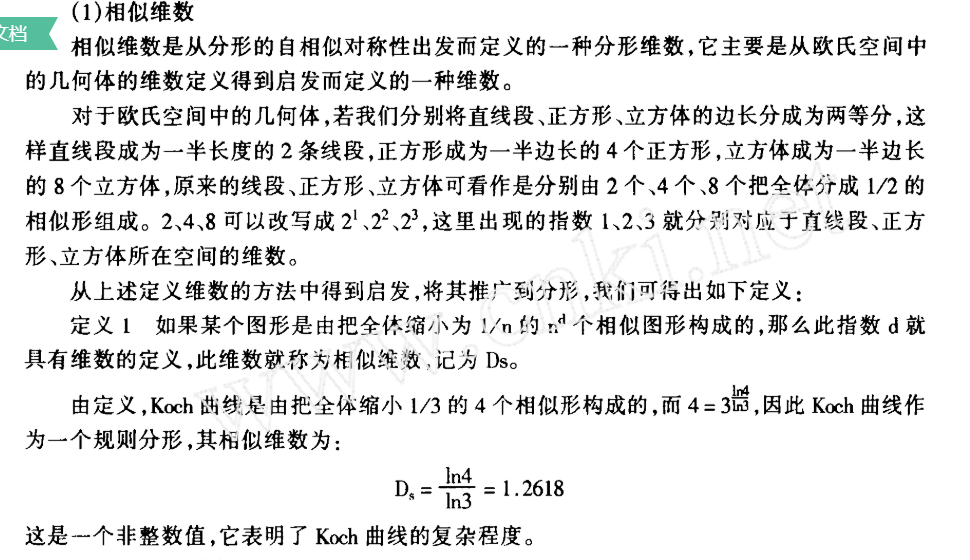

## 分形维数：
通常欧几里德几何中，直线或曲线是1维的，平面或球面是2维的，具有长、宽、高的形体是 3 维的；然而对于分形如海岸线、科赫曲线、谢尔宾斯基海绵等的复杂性无法用维数等于 1、2、3 这样的数值来描述。科赫曲线第一次变换将1英尺的每边换成4个长1/3英寸的线段，总长度变为 3×4×1/3=4 英寸；每一次变换使总长度变为乘以4/3，如此无限延续下去，曲线本身将是无限长的。这是一条连续的回线，永远不会自我相交，回线所围的面积是有限的，它小于一个外接圆的面积。因此科赫曲线以它无限长度挤在有限的面积之内，确实是占有空间的 ，它比1维要多，但不及2维图形，也就是说它的维数在1和2之间，维数是分数。同样，谢尔宾斯基海绵内部全是大大小小的空洞，表面积是无限大，而占有的 3 维空间是有限的，其维数在2和3之间。
用适当维度的尺才能衡量该集合的大小
- Hausdorff维

- 相似维
