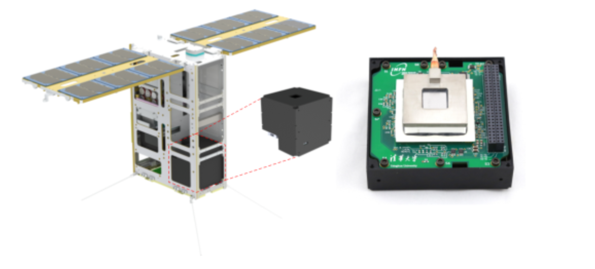

# 天格组会：立方星天体物理培训

* 主讲人：冯骅
* 时间：2019/9/12

[TOC]

---

## 极光计划

* 卫星不太成熟，最初三个月几乎没有做什么，都是卫星在调数传、姿控
* 之后观测到了蟹状星云脉冲星 glitch（脉冲星发生了类似地震现象，转动惯量减小，自转角速度突然加大）
* 现在已经拿到了很多数据，在分析，争取下个月投出去
* 偏振
  * 可见光偏振很常见，手机、电脑屏幕，很多墨镜是偏振的，可以转动试试看，但是手机屏幕一般加了1/4波片，变为了圆偏振光
  * 大气瑞利散射导致蓝天、红夕阳，90°方向最明显
  * 但是X射线波长短，X射线偏振探测很难
  * 很多天文现象会产生偏振现象，电子加速产生轫致辐射
  * 强磁场下等离子体极化，成为天然的偏振滤波片，穿过来后的全是垂直于磁场线
  * 再强的磁场，真空极化
* 散射
  * 受迫振动的再辐射
* 偏振探测
  * 布拉格衍射，但是能量太窄，效率太低
  * 光电效应，出射电子最可能沿着偏振方向出射，垂直偏振方向出射；但是需要二维位置灵敏的，分辨率v高的气体探测器，CERN做到

* 极光
  * 气体小室
  * 2 cm $\times$ 2 cm 窗
  * CMOS
  * 极光的MCU不可固件更新，GRID可以
 
* NASA的IXPE和中国的eXTP（2025）

## 立方星
* 1999开始发展起来，美国加州
* 载荷单元，U(nit)
* 熔断约束，弹出发射立方星
* 元件比较贵，宇航级别，要求很高
* 发射比较贵
* 立方星的优势：基于多技术的，基于少数目标的

## 从实验室到空间

* 测试训练