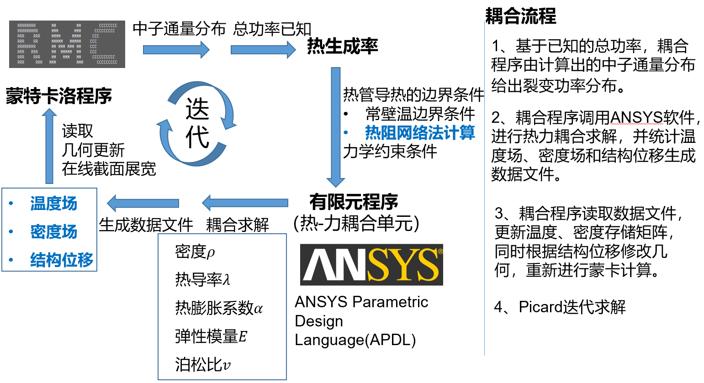

# RMC&APDL核热力耦合培训
* 主讲人：刘旻昀
* 时间：2019/10/12 10:20-12:00

---

[TOC]

---

## RMC输入卡
* VS中可以远程选择调试Linux，方便超算移植
* 使用TMS（靶核在线截面展宽）现在是基于0K进行多普勒展宽的，需要使用截面数据为.00c的，注意Ace指令打开，ptable概率插值语句
* tmp指定cell的温度
* cellmap_fuel实现网格对应
* COUPLE_NTM进行核热力耦合，若是加上燃耗则COUPLE_NTMB
* 设定的 power totalpower 是平均功率，除以了体积的

## 核心程序 
* 通过关键词读输入卡
* GenerateInpFile一定要做一下这个，是生成RMC自己能识别的几何逻辑，存在内存里
* RMC计算模式选择，是选择临界、核热力耦合等等模式
## 临界计算
* ORNG.getrandseed得到随机数中子
* SampleFisSource 源抽样，抽取源位置
* trachistory 统计这个中子的历史（是怎么从生到死的）
* 蒙卡是每个中子单独模拟从生到死，而不是所有中子一起模拟。是相互独立的，因为稀薄中子假设，不考虑中子与中子相互作用。
* geometrytracking_TMS，抽样中子轨迹，若到边界则认为只走了到边界那么远，然后重新抽样
  * samplefreeflydis_TMS 抽样飞行自由程，$s=-\dfrac{\ln{\xi}}{\Sigma_t}$，其中$\xi$是(0,1)均匀随机数
  * 计算distanceToBoundary,计算到栅元边界距离，若飞行距离超过到栅元边界的距离，则认为只走到栅元边界，然后寻找下一个栅元，继续抽样。若是没到栅元边界，则正常进行
  * 抽样碰撞核，抽样碰撞类型
* 蒙卡就是基于概率什么都抽样，方向也是抽的，自由程也是抽的，碰撞核是抽样的，碰撞类型也是抽的。如果发生裂变，则此中子死去，产生的源分布被记录下来作为下一次的源。初始源认为各向同性，裂变产生中子方向也是各向同性。非活跃代是为了让初始源分布比较合理。
  
## 核热力耦合
* 输入卡设置最大迭代次数，若没有到达收敛准则也就到最大此时结束迭代
* itergeomery定义了一个孪生几何，存储之后会改变的几何
* 若是第一次迭代，其实就是临界计算，没有反馈，把得到的功率写给 ANSYS，用write_power_HPR函数
  * 读取CellTally编号对应，数组写入对应功率密度
  * 因为RMC统计得到的是相对功率分布，需要将功率转换为实际功率。具体是通过相对功率分布得到功率占比，再乘以平均功率得到实际功率密度，注意RMC功率密度单位为W/m^3。量级记忆：热堆一般为1e8，而热管堆一般为1e7，差一个数量级。注：反应堆能够运行在任意功率水平，因此要确定功率分布除了相对功率分布还需要一个总功率条件
  * 读取RMC当前路径，按照格式将ANSYS所需要的输入写入.dat文件存入某路径
  * 收敛判据为功率收敛，分为方差均值和方差最大值的两步误差限判断。但是具体收敛判据取多少还很经验，很不严格，而且很多时候不能达到收敛判据，强制停止。究竟核热力耦合会不会收敛还是需要研究。
  * 提交apdl输入给天河，apdl_submit.sh，调用apdl.sh，ansys开始运行计算
  * apdl跑的过程中会产生check文件，如何判断apdl是否算完呢？是查找里面是否有……finished！的语句
* APDL_main.apdl是apdl运行的主程序
  * 读取迭代次数，如果是第一次迭代是要特殊处理的
  * iteration+次数命名
  * 读取RMC写出的功率分布
  * 注意热计算中，初始温度要设置得比热管温度高，不能随便设，不然温度升不上去，陷入初值陷阱
  * apdl中进行的过程：**热-力-热-保存几何**
  * 几何更新：计算形变后堆芯下表面位置，等等将形变后需要的各个几何位置计算出来
  * 不考虑形变后平面变曲面，圆变形等等，认为变形比例小，通过取形变最大最小再取两者均值，而不用全部平均（那样可能会受网格不同影响），再通过平均参数设置新的规则几何
  * 注：热管只是空腔不需要真的几何建模
  * 更新后的几何写入write_data.apdl
* RMC读取更新几何
  * 如果路径下有几何反馈文件，则使用用
  * 如果路径下没反馈文件，则用自己默认的生成几何
* 有一步收敛趋势，第二次迭代就$k_{eff}$已经基本收敛了
## 总结
* 温度反馈是多普勒展宽更新微观截面
* 密度反馈是直接更新宏观截面
* 形变反馈是更新几何
* 若加燃耗反馈是更新材料配比（如U富集度）
* 若加燃料行为反馈（如肿胀等等）是更新几何、材料密度、热导率等热物性质

